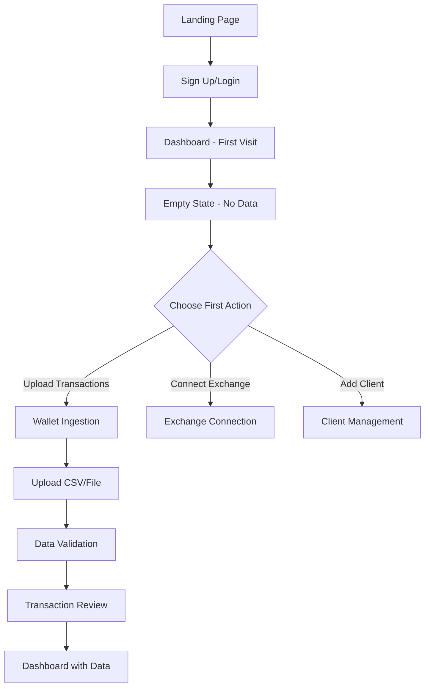
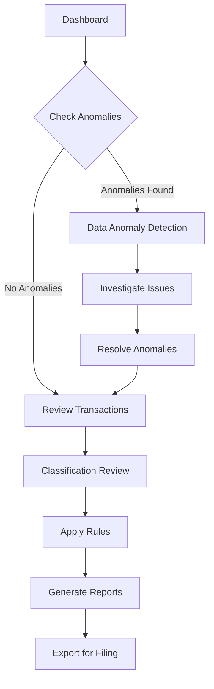
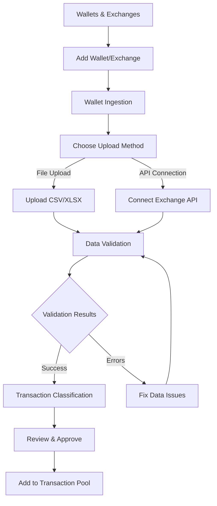

# User Flow Documentation

## 📋 Overview

This document outlines the complete user journey and navigation flows for the Computis crypto tax preparation application.

## 🗺️ Application Structure

```
┌─────────────────────────────────────────────────────────────────┐
│                        COMPUTIS APP                             │
├─────────────────────────────────────────────────────────────────┤
│ SIDEBAR NAVIGATION                                              │
├────────��────────────────────────────────────────────────────────┤
│ • Dashboard (/)                                                 │
│ • Transactions (/transactions)                                 │
│   └─ Data Anomaly Detection (/data-anomaly-detection)          │
│ • Wallets and Exchanges (/wallets)                             │
│   └─ Wallet Ingestion (/wallet-ingestion)                      │
│ • Clients (/clients)                                           │
│                                                                 │
│ REPORTS                                                         │
│ • IRS 8949 (/irs-8949)                                        │
│ • Gain/Loss (/gain-loss)                                      │
│ • Exports (/exports)                                          │
│                                                                 │
│ SETTINGS                                                        │
│ • General Settings (/settings)                                 │
│ • Preferences (/preferences)                                   │
│ • Rule Engine (/rule-engine)                                  │
│                                                                 │
│ HELP & ACCOUNT                                                  │
│ • My Account                                                    │
│ • Help Page                                                     │
│ • Keyboard Shortcuts                                           │
└─────────────────────────────────────────────────────────────────┘
```

## 🏠 Primary User Flows

### 1. New User Onboarding Flow



### 2. Daily Tax Preparation Workflow



### 3. Transaction Processing Flow



## 📊 Detailed Screen Flows

### Dashboard Flow
```
Dashboard (/)
├─ Overview Cards (Totals, Gains/Losses, Transactions)
├─ Recent Uploads Table
├─ Anomaly Flags Section
│  └─ [View All] → Data Anomaly Detection
├─ Quick Actions
│  ├─ [Upload Transactions] → Wallet Ingestion
│  ├─ [Generate Report] → IRS 8949 or Gain/Loss
│  └─ [Add Client] → Client Management
└─ Recent Activity Feed
```

### Transactions Flow
```
Transactions (/transactions)
├─ Filter Controls (Confidence, Status, Date Range)
├─ Bulk Actions (Tag, Classify, Export)
├─ Transactions Table
│  ├─ Individual Transaction Actions
│  │  ├─ [Edit] → Transaction Detail Modal
│  │  ├─ [Classify] → Classification Dialog
│  │  └─ [View Details] → Transaction Details
│  └─ Pagination Controls
├─ AI Classification Insights Panel
├─ Anomaly Flags Panel
│  └─ [View All] → Data Anomaly Detection
└─ Export Options
```

### Data Anomaly Detection Flow
```
Data Anomaly Detection (/data-anomaly-detection)
├─ Filter Tabs (All Issues, High Priority, Resolved, etc.)
├─ Overview Cards (Data Spikes, Missing FMV, etc.)
├─ Issues Table
│  ├─ Individual Issue Actions
│  │  ├─ [Investigate] → Issue Details
│  │  ├─ [Mark Resolved] → Update Status
│  │  └─ [Ignore] → Dismiss Issue
│  └─ Bulk Resolution Actions
├─ Issue Details Modal
│  ├─ Issue Information
│  ├─ Affected Transactions Table
│  ├─ AI Recommendations
│  └─ Quick Actions (Bulk Classify, Create Rule, etc.)
└─ Resolution Actions
```

### Wallet Ingestion Flow
```
Wallet Ingestion (/wallet-ingestion)
├─ Upload Methods Tabs
│  ├─ File Upload Tab
│  │  ├─ Drag & Drop Area
│  │  ├─ File Format Support (CSV, XLSX)
│  │  └─ Upload Progress
│  ├─ API Connection Tab
│  │  ├─ Exchange Selection
│  │  ├─ API Key Input
│  │  └─ Connection Test
│  └─ Manual Entry Tab
│     ├─ Transaction Form
│     └─ Bulk Entry Options
├─ Supported Exchanges Grid
├─ Recent Uploads Table
│  ├─ Upload Status
│  ├─ Processing Progress
│  └─ [View Results] → Transaction Review
└─ Processing Results
   ├─ Success Summary
   ├─ Error Reports
   └─ [Review Transactions] → Transactions
```

### Client Management Flow
```
Clients (/clients)
├─ Tabs (Clients, Users, Tax Entities, Permissions)
├─ Client List
│  ├─ Search & Filters
│  ├─ Bulk Actions
│  └─ Individual Client Actions
│     ├─ [Edit] → Client Details Form
│     ├─ [Manage Users] → User Management
│     └─ [Tax Entities] → Entity Management
├─ Add Client Flow
│  ├─ Client Information Form
│  ├─ User Setup
│  └─ Permissions Configuration
├─ Roles & Permissions Management
│  ├─ Role Creation
│  ├─ Permission Matrix
│  └─ User Assignment
└─ Recent Tax Entities Table
```

### Reports Generation Flow
```
IRS 8949 (/irs-8949) & Gain/Loss (/gain-loss)
├─ Year Selection & Filters
├─ Summary Cards (Totals, Breakdown)
├─ Transaction Tables
│  ├─ Part I (Short-term) & Part II (Long-term)
│  ├─ Bulk Selection
│  └─ Individual Transaction Actions
├─ Form Generation Options
│  ├─ [Download PDF] → PDF Generation
│  ├─ [Download CSV] → CSV Export
│  └─ [Schedule E-filing] → Filing Integration
├─ Tax Implications Summary
└─ Ready for Filing Status
```

### Exports Flow
```
Exports (/exports)
├─ Export Type Selection
│  ├─ CSV Exports
│  ├─ PDF Reports
│  ├─ Tax Forms
│  └─ Custom Formats
├─ Export Configuration
│  ├─ Date Range Selection
│  ├─ Data Fields Selection
│  ├─ Filtering Options
│  └─ Format Options
├─ Data Validation Panel
│  ├─ Missing Data Alerts
│  ├─ Validation Issues
│  └─ Data Quality Score
├─ Recent Exports Table
│  ├─ Export Status
│  ├─ Download Links
│  └─ Re-export Options
└─ Export Actions
   ├─ [Generate Export] → Processing
   ├─ [Schedule Export] → Recurring Setup
   └─ [Download] → File Download
```

### Settings & Preferences Flow
```
General Settings (/settings)
├─ Tabs (Account, Preferences, Notifications, Security, Data)
├─ Account Information
│  ├─ Personal Details Form
│  ├��� Organization Settings
│  └─ Timezone Configuration
├─ Tax Preferences
│  ├─ Cost Basis Method
│  ├─ Default Currency
│  └─ Rounding Precision
├─ Security Settings
│  ├─ 2FA Configuration
│  ├─ API Access Management
│  └─ Session Settings
└─ Data Management
   ├─ Backup Settings
   ├─ Retention Policies
   └─ Data Export/Import

Preferences (/preferences)
├─ Appearance Settings
│  ├─ Theme Selection (Light/Dark/System)
│  ├─ Color Scheme Options
│  ├─ Font Size Adjustment
│  └─ Interface Density
├─ Layout Preferences
│  ├─ Sidebar Position
│  ├─ Table Display Options
│  └─ Compact Mode Toggle
├─ Behavior Settings
│  ├─ Auto-save Configuration
│  ├─ Notification Preferences
│  └─ Language & Region
└─ Accessibility Features
   ├─ Screen Reader Support
   ├─ High Contrast Mode
   ├─ Keyboard Navigation
   └─ Reduced Motion
```

## 🔄 Interactive Flows

### Error Handling Flow
```
Any Screen → Error Occurs
├─ Network Error
│  ├─ Display Error State
│  ├─ [Retry] Button
│  └─ Offline Indication
├─ Validation Error
│  ├─ Inline Error Messages
│  ├─ Form Field Highlighting
│  └─ Error Summary
├─ Permission Error
│  ├─ Access Denied Message
│  ├─ Contact Admin Action
│  └─ Login Redirect
└─ Server Error
   ├─ Generic Error Message
   ├─ Error Code Display
   └─ Support Contact Option
```

### Loading States Flow
```
Any Data Loading
├─ Initial Load
│  ├─ Page Loading Skeleton
│  ├─ Component Skeletons
│  └─ Progress Indicators
├─ Background Updates
│  ├─ Spinner Indicators
│  ├─ Disabled States
│  └─ Loading Text
└─ File Processing
   ├─ Upload Progress Bar
   ├─ Processing Status
   └─ Completion Notification
```

### Search & Filter Flow
```
Search Functionality
├─ Global Search (Ctrl+K)
│  ├─ Command Palette
│  ├─ Quick Actions
│  ├─ Navigation Shortcuts
│  └─ Recent Items
├─ Table Filtering
│  ├─ Column Filters
│  ├─ Date Range Pickers
│  ├─ Multi-select Options
│  └─ Advanced Filters
└─ Search Results
   ├─ Result Highlighting
   ├─ No Results State
   └─ Search Suggestions
```

## 📱 Responsive Behavior

### Mobile Navigation Flow
```
Mobile View (<768px)
├─ Collapsed Sidebar
│  ├─ Hamburger Menu Button
│  ├─ Overlay Navigation
│  └─ Touch-friendly Targets
├─ Stacked Layouts
│  ├─ Single Column Cards
│  ├─ Collapsible Sections
│  └─ Vertical Form Layouts
├─ Table Adaptations
│  ├─ Horizontal Scroll
│  ├─ Hidden Columns
│  └─ Card-based Views
└─ Touch Interactions
   ├─ Swipe Gestures
   ├─ Pull-to-refresh
   └─ Touch Targets (44px min)
```

### Tablet Adaptation Flow
```
Tablet View (768px - 1024px)
├─ Adaptive Sidebar
│  ├─ Collapsible Option
│  ├─ Icon-only Mode
│  └─ Full Sidebar Mode
├─ Two-column Layouts
│  ├─ Master-detail Views
│  ├─ Side-by-side Forms
│  └─ Split Content Areas
└─ Enhanced Touch Support
   ├─ Larger Touch Targets
   ├─ Gesture Support
   └─ Adaptive Spacing
```

## ⌨️ Keyboard Navigation Flow

### Global Shortcuts
```
Application-wide
├─ Ctrl+K → Open Command Palette
├─ Ctrl+S → Save Current Form
├─ Ctrl+/ → Show Keyboard Shortcuts
├─ Esc → Close Modals/Overlays
├─ Ctrl+1-9 → Navigate to Tab
└─ Alt+Arrow → Navigate Sidebar
```

### Component Navigation
```
Tables
├─ Arrow Keys → Navigate Cells
├─ Tab → Next Interactive Element
├─ Enter → Activate Selection
├─ Space → Toggle Selection
└─ Home/End → First/Last Row

Forms
├─ Tab → Next Field
├─ Shift+Tab → Previous Field
├─ Enter → Submit Form
├─ Esc → Cancel/Reset
└─ Arrow Keys → Radio/Checkbox Groups

Modals
├─ Tab → Cycle Through Elements
├─ Esc → Close Modal
├─ Enter → Confirm Action
└─ Focus Trap → Keep Focus Inside
```

## 🎯 User Goals & Success Metrics

### Primary User Goals
1. **Upload and process crypto transactions**
   - Success: Clean data import with minimal errors
   - Metrics: Upload success rate, processing time

2. **Identify and resolve data anomalies**
   - Success: All anomalies addressed before filing
   - Metrics: Anomaly resolution rate, time to resolution

3. **Generate accurate tax reports**
   - Success: IRS-compliant forms ready for filing
   - Metrics: Report generation success, accuracy validation

4. **Manage client relationships** (for professionals)
   - Success: Efficient client onboarding and management
   - Metrics: Client satisfaction, processing efficiency

### Secondary User Goals
1. **Customize application preferences**
   - Success: Personalized, accessible experience
   - Metrics: Settings adoption, accessibility usage

2. **Maintain data security and compliance**
   - Success: Secure data handling throughout
   - Metrics: Security incident rate, compliance checks

3. **Collaborate with team members** (for firms)
   - Success: Seamless multi-user workflows
   - Metrics: User collaboration efficiency, role usage

## 🔍 Edge Cases & Error Scenarios

### Data Processing Errors
- Unsupported file formats → Clear error message + format guidance
- Corrupted data → Validation errors + manual correction options
- Large file uploads → Progress indication + chunked processing
- Network timeouts → Retry mechanisms + offline indicators

### User Access Issues
- Insufficient permissions → Clear explanation + contact admin option
- Session expiration → Auto-save + seamless re-authentication
- Account suspension → Status explanation + support contact

### System Limitations
- Storage limits → Usage indicators + upgrade prompts
- Processing capacity → Queue status + estimated completion
- Feature limits → Clear boundaries + upgrade paths

This comprehensive user flow documentation ensures that every user interaction has been considered and designed for optimal user experience across all device types and accessibility needs.
