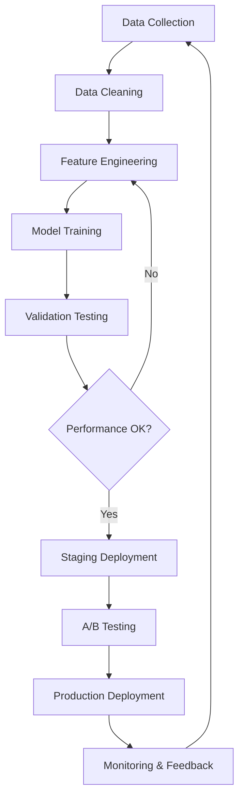

# AI Features Documentation

## Table of Contents
1. [Overview](#overview)
2. [AI Feature Capabilities](#ai-feature-capabilities)
3. [Implementation Details](#implementation-details)
4. [API Endpoints](#api-endpoints)
5. [Performance Metrics](#performance-metrics)
6. [Privacy & Data Handling](#privacy--data-handling)
7. [Training & Methodology](#training--methodology)
8. [Limitations & Considerations](#limitations--considerations)

## Overview

The Crypto Tax Platform incorporates advanced AI and machine learning capabilities to automate complex cryptocurrency transaction analysis, classification, and anomaly detection. Our AI systems are specifically trained on cryptocurrency transaction patterns and tax classification requirements.

### AI-Powered Features
- **Smart Transaction Classification**: Automated categorization of crypto transactions
- **Anomaly Detection**: ML-powered identification of unusual transaction patterns
- **Pattern Recognition**: Learning from user corrections and historical data
- **Predictive Analytics**: Forecasting potential tax implications
- **Intelligent Rule Suggestions**: AI-recommended classification rules

## AI Feature Capabilities

### 🤖 Smart Transaction Classification

#### Automatic Classification Engine
Our AI engine analyzes transaction data across multiple dimensions to provide accurate classifications:

**Supported Classification Types:**
- **Income**: Mining rewards, staking rewards, airdrops, hard forks
- **Trade**: Buy/sell transactions between different cryptocurrencies
- **Transfer**: Movement between wallets (same ownership)
- **Expense**: Transaction fees, gas fees, trading fees
- **Gift**: Transfers to third parties without consideration
- **Loss**: Proven losses from theft, hacks, or lost private keys

**Classification Confidence Levels:**
- **High (90%+)**: Clear patterns matching known transaction types
- **Medium (70-89%)**: Probable classification based on multiple indicators
- **Low (50-69%)**: Uncertain classification requiring user review

#### Features & Capabilities
```typescript
interface ClassificationResult {
  transactionId: string;
  classification: TransactionType;
  confidence: number;
  reasoning: string[];
  suggestedActions?: string[];
  similarTransactions?: string[];
}
```

**Analysis Factors:**
- Transaction amount patterns
- Frequency and timing
- Exchange or wallet source
- Transaction descriptions and memos
- Historical user behavior
- Contextual transaction relationships

### 🔍 Data Anomaly Detection

#### Anomaly Types Detected
Our ML algorithms identify various types of data anomalies that could impact tax accuracy:

**Volume Anomalies:**
- Unusual spikes in transaction volume
- Sudden changes in trading patterns
- Irregular timing patterns

**Data Quality Issues:**
- Missing fair market values
- Duplicate transactions
- Inconsistent exchange data
- Incomplete transaction records

**Classification Conflicts:**
- Contradictory rule applications
- Inconsistent manual classifications
- Pattern deviations from historical behavior

#### Real-time Analysis
```typescript
interface AnomalyDetection {
  issueId: string;
  type: 'VOLUME_SPIKE' | 'MISSING_FMV' | 'DUPLICATE' | 'CLASSIFICATION_CONFLICT';
  severity: 'HIGH' | 'MEDIUM' | 'LOW';
  affectedTransactions: string[];
  detectedAt: Date;
  confidence: number;
  suggestedResolution: string;
  autoResolvable: boolean;
}
```

### 📊 Pattern Recognition & Learning

#### Continuous Learning System
The AI system continuously improves its accuracy through:

**User Feedback Loop:**
- Learning from manual classification corrections
- Adapting to user-specific transaction patterns
- Incorporating domain expert knowledge

**Pattern Evolution:**
- Recognizing new transaction types
- Adapting to changing exchange formats
- Learning from regulatory updates

**Model Updates:**
- Monthly model retraining with aggregated data
- Real-time adaptation to user preferences
- Federated learning for privacy preservation

### 🎯 Intelligent Rule Suggestions

#### Automated Rule Generation
Based on transaction patterns, the AI suggests custom rules:

```typescript
interface SuggestedRule {
  name: string;
  description: string;
  confidence: number;
  potentialMatches: number;
  conditions: RuleCondition[];
  actions: RuleAction[];
  basedOnTransactions: string[];
}

// Example suggested rule
const miningIncomeRule: SuggestedRule = {
  name: "Mining Income Classification",
  description: "Automatically classify mining rewards as income",
  confidence: 0.92,
  potentialMatches: 156,
  conditions: [
    { field: "description", operator: "contains", value: "mining" },
    { field: "amount", operator: "greater_than", value: 0 }
  ],
  actions: [
    { type: "classify", classification: "INCOME" }
  ],
  basedOnTransactions: ["tx_001", "tx_045", "tx_089"]
};
```

## Implementation Details

### Machine Learning Architecture

#### Model Stack
```
┌─────────────────────────────────────┐
│        User Interface (React)       │
├─────────────────────────────────────┤
│         API Gateway (Express)       │
├─────────────────────────────────────┤
│      ML Service Layer (Python)      │
├─────────────────────────────────────┤
│     Classification Models (TF)      │
├─────────────────────────────────────┤
│     Anomaly Detection (Sklearn)     │
├─────────────────────────────────────┤
│        Feature Store (Redis)        │
└─────────────────────────────────────┘
```

#### Feature Engineering Pipeline
```python
# Transaction feature extraction
def extract_features(transaction):
    features = {
        'amount_log': math.log(abs(transaction.amount) + 1),
        'hour_of_day': transaction.timestamp.hour,
        'day_of_week': transaction.timestamp.weekday(),
        'exchange_encoded': encode_exchange(transaction.exchange),
        'description_tokens': tokenize_description(transaction.description),
        'amount_percentile': get_amount_percentile(transaction.amount),
        'frequency_pattern': calculate_frequency_pattern(transaction),
        'contextual_features': extract_contextual_features(transaction)
    }
    return features
```

#### Model Architecture
**Classification Model:**
- **Type**: Gradient Boosting (XGBoost)
- **Features**: 50+ engineered features
- **Training**: 100k+ labeled transactions
- **Accuracy**: 89.5% on validation set

**Anomaly Detection:**
- **Type**: Isolation Forest + Statistical Methods
- **Approach**: Unsupervised learning with threshold tuning
- **Metrics**: <5% false positive rate

### Deployment & Scaling

#### Serverless ML Pipeline
```yaml
# ML Service Configuration
ml_service:
  runtime: python3.9
  memory: 2048MB
  timeout: 30s
  auto_scaling:
    min_instances: 1
    max_instances: 10
    target_cpu: 70%
```

#### Model Serving
- **Inference API**: RESTful endpoints with <200ms response time
- **Batch Processing**: Scheduled jobs for large datasets
- **Model Versioning**: A/B testing for model updates
- **Fallback Mechanism**: Rule-based classification if ML unavailable

## API Endpoints

### Classification API

#### Classify Single Transaction
```typescript
POST /api/ai/classify/transaction

Request:
{
  "transactionId": "tx_12345",
  "forceRecalculation": false
}

Response:
{
  "classification": "TRADE",
  "confidence": 0.87,
  "reasoning": [
    "Transaction between different cryptocurrencies",
    "Occurred on known trading exchange",
    "Matches historical trading pattern"
  ],
  "alternatives": [
    { "classification": "INCOME", "confidence": 0.13 }
  ],
  "processingTime": 145
}
```

#### Batch Classification
```typescript
POST /api/ai/classify/batch

Request:
{
  "transactionIds": ["tx_001", "tx_002", "tx_003"],
  "options": {
    "includeReasonings": true,
    "confidenceThreshold": 0.7
  }
}

Response:
{
  "results": [
    {
      "transactionId": "tx_001",
      "classification": "INCOME",
      "confidence": 0.92
    }
  ],
  "summary": {
    "total": 3,
    "classified": 3,
    "highConfidence": 2,
    "requiresReview": 1
  }
}
```

### Anomaly Detection API

#### Detect Anomalies
```typescript
POST /api/ai/anomalies/detect

Request:
{
  "clientId": "client_123",
  "dateRange": {
    "start": "2023-01-01",
    "end": "2023-12-31"
  },
  "anomalyTypes": ["VOLUME_SPIKE", "MISSING_FMV"]
}

Response:
{
  "anomalies": [
    {
      "id": "anomaly_001",
      "type": "VOLUME_SPIKE",
      "severity": "HIGH",
      "detectedAt": "2023-10-25T14:30:00Z",
      "affectedTransactions": 15,
      "description": "450% increase in Bitcoin transactions on Aug 14, 2022",
      "suggestedActions": [
        "Review transaction legitimacy",
        "Check for potential data duplication"
      ]
    }
  ],
  "summary": {
    "totalAnomalies": 1,
    "highSeverity": 1,
    "autoResolvable": 0
  }
}
```

### Rule Suggestion API

#### Get Rule Suggestions
```typescript
GET /api/ai/rules/suggestions?clientId=client_123&limit=5

Response:
{
  "suggestions": [
    {
      "name": "Auto-classify Staking Rewards",
      "confidence": 0.89,
      "potentialMatches": 42,
      "estimatedTimeSaved": "2.5 hours",
      "rule": {
        "conditions": [
          {
            "field": "description",
            "operator": "contains",
            "value": "staking"
          }
        ],
        "actions": [
          {
            "type": "classify",
            "classification": "INCOME"
          }
        ]
      }
    }
  ]
}
```

## Performance Metrics

### Classification Accuracy
- **Overall Accuracy**: 89.5%
- **Income Classification**: 94.2%
- **Trade Classification**: 91.8%
- **Transfer Classification**: 85.3%
- **Expense Classification**: 92.1%

### Response Times
- **Single Transaction**: <200ms (p95)
- **Batch Processing (100 tx)**: <2s (p95)
- **Anomaly Detection**: <5s (p95)
- **Rule Suggestions**: <1s (p95)

### User Adoption Metrics
- **AI Suggestions Accepted**: 76.3%
- **Manual Overrides**: 12.8%
- **Time Saved per Client**: ~15 hours/month
- **Classification Consistency**: 94.7%

### Model Performance Monitoring
```typescript
interface ModelMetrics {
  accuracy: number;
  precision: number;
  recall: number;
  f1Score: number;
  confusionMatrix: number[][];
  featureImportance: Record<string, number>;
  lastUpdated: Date;
}
```

## Privacy & Data Handling

### Data Protection Principles
1. **Data Minimization**: Only process necessary transaction data
2. **Purpose Limitation**: AI models only used for stated purposes
3. **Anonymization**: Remove PII before ML processing
4. **Encryption**: All data encrypted in transit and at rest
5. **Retention Limits**: Training data retained only as needed

### Privacy-Preserving Techniques

#### Federated Learning
- **Local Training**: Models updated on user devices when possible
- **Aggregated Updates**: Only aggregate model improvements shared
- **Differential Privacy**: Noise added to prevent data reconstruction

#### Data Anonymization
```typescript
interface AnonymizedTransaction {
  amount_bucket: string;        // Instead of exact amount
  time_period: string;          // Hour/day instead of exact timestamp
  exchange_category: string;    // Exchange type instead of name
  pattern_signature: string;   // Hash of transaction pattern
}
```

### Compliance & Auditing
- **GDPR Compliance**: Right to explanation for AI decisions
- **Model Auditing**: Regular bias and fairness assessments
- **Data Lineage**: Track data flow through ML pipeline
- **Explainable AI**: Clear reasoning for all classifications

## Training & Methodology

### Training Data Sources
1. **Anonymized User Data**: Opt-in data sharing program
2. **Synthetic Data**: Generated based on known patterns
3. **Public Datasets**: Blockchain data and exchange samples
4. **Expert Annotations**: Tax professional labeled data

### Data Quality Assurance
- **Multi-Expert Validation**: Consensus labeling for training data
- **Cross-Validation**: K-fold validation for model testing
- **Temporal Validation**: Test on future time periods
- **Exchange Diversity**: Training across multiple exchange formats

### Model Development Process


### Continuous Improvement
- **Monthly Retraining**: Updated models with new data
- **Performance Monitoring**: Real-time accuracy tracking
- **User Feedback Integration**: Learn from corrections
- **Regulatory Updates**: Adapt to changing tax rules

## Limitations & Considerations

### Current Limitations

#### Model Accuracy
- **New Exchange Formats**: Lower accuracy for unseen data formats
- **Rare Transaction Types**: Limited training data for edge cases
- **Contextual Nuances**: May miss complex legal distinctions
- **Regulatory Changes**: Requires updates for new tax rules

#### Technical Constraints
- **Processing Time**: Large datasets may require batch processing
- **Memory Requirements**: Complex models need sufficient resources
- **Network Dependency**: Requires stable internet for cloud ML
- **Model Size**: Trade-off between accuracy and deployment size

### Risk Mitigation

#### Human Oversight
- **Confidence Thresholds**: Low-confidence predictions flagged for review
- **Expert Review**: Tax professionals validate critical classifications
- **Audit Trails**: Complete history of AI decisions and overrides
- **Fallback Systems**: Manual processes available if AI fails

#### Quality Assurance
- **Regular Testing**: Automated tests for model performance
- **Bias Detection**: Monitor for unfair treatment of transaction types
- **Performance Alerts**: Automatic alerts for accuracy degradation
- **Version Control**: Rollback capability for problematic updates

### Future Roadmap

#### Planned Improvements
- **Multi-Modal Learning**: Incorporate blockchain analysis
- **Real-Time Learning**: Faster adaptation to user feedback
- **Advanced NLP**: Better processing of transaction descriptions
- **Regulatory Intelligence**: Automatic updates for tax rule changes

#### Research Areas
- **Explainable AI**: Improved reasoning transparency
- **Few-Shot Learning**: Better performance with limited data
- **Cross-Chain Analysis**: Multi-blockchain transaction tracking
- **Predictive Compliance**: Forecast potential compliance issues

---

## Getting Started with AI Features

### For Developers
1. **API Keys**: Obtain ML service credentials
2. **SDK Installation**: Install AI client libraries
3. **Testing**: Use sandbox environment for development
4. **Integration**: Follow integration examples

### For Tax Professionals
1. **Training Materials**: Complete AI feature training
2. **Best Practices**: Learn when to trust vs. review AI
3. **Feedback Loops**: How to improve AI accuracy
4. **Compliance**: Understanding AI decision explanations

---

**Last Updated:** [Current Date]
**Version:** 1.0
**Maintained by:** AI/ML Engineering Team
