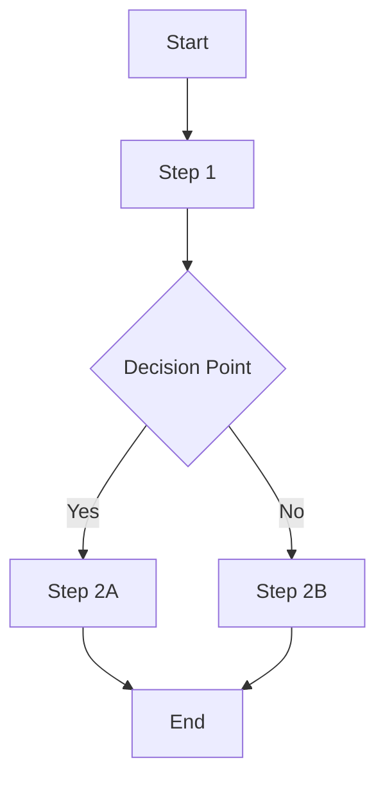

# Feature Specification Template

## Feature Overview

**Feature Name:** [Feature Name]
**Epic/Initiative:** [Link to Epic]
**Status:** [Draft/In Review/Approved/In Development/Complete]
**Priority:** [High/Medium/Low]
**Target Release:** [Version/Date]

### Problem Statement

Describe the problem this feature solves. Include:

- Current pain points
- User impact
- Business impact
- Success metrics

### Proposed Solution

High-level description of the proposed solution including:

- Core functionality
- User experience improvements
- Technical approach
- Integration points

## Requirements

### Functional Requirements

1. **Requirement 1**
   - Description
   - Acceptance criteria
   - Priority: [Must Have/Should Have/Could Have]

2. **Requirement 2**
   - Description
   - Acceptance criteria
   - Priority: [Must Have/Should Have/Could Have]

### Non-Functional Requirements

- **Performance:** Response time, throughput, scalability requirements
- **Security:** Authentication, authorization, data protection
- **Accessibility:** WCAG compliance, keyboard navigation
- **Compatibility:** Browser support, device compatibility
- **Reliability:** Uptime, error handling, recovery

## User Experience

### User Stories

- **As a** [user type], **I want** [functionality] **so that** [benefit]
- **As a** [user type], **I want** [functionality] **so that** [benefit]

### User Flows



### Wireframes/Mockups

- Link to design files
- Key screen descriptions
- Interaction specifications

## Technical Specification

### Architecture

- Component architecture
- Data flow
- Integration points
- Dependencies

### API Changes

```typescript
// New endpoints
GET / api / feature / endpoint;
POST / api / feature / endpoint;

// Modified endpoints
PATCH / api / existing / endpoint;
```

### Database Changes

```sql
-- New tables
CREATE TABLE feature_table (
    id UUID PRIMARY KEY,
    created_at TIMESTAMP DEFAULT NOW()
);

-- Modified tables
ALTER TABLE existing_table ADD COLUMN new_field VARCHAR(255);
```

### Security Considerations

- Authentication requirements
- Authorization rules
- Data protection measures
- Potential vulnerabilities

## Implementation Plan

### Development Phases

1. **Phase 1:** [Description] - [Timeline]
2. **Phase 2:** [Description] - [Timeline]
3. **Phase 3:** [Description] - [Timeline]

### Dependencies

- External dependencies
- Internal dependencies
- Blocking factors

### Testing Strategy

- Unit test coverage
- Integration test scenarios
- E2E test cases
- Performance testing
- Security testing

## Documentation Requirements

### User Documentation

- Feature usage guide
- Help articles
- Video tutorials
- FAQ updates

### Technical Documentation

- API documentation
- Component documentation
- Architecture updates
- Deployment notes

### Content Updates

- UI copy
- Error messages
- Help text
- Marketing content

## Success Metrics

### Key Performance Indicators

- Primary metric: [Description and target]
- Secondary metrics: [List with targets]

### Acceptance Criteria

- [ ] All functional requirements implemented
- [ ] Performance benchmarks met
- [ ] Security review completed
- [ ] Accessibility audit passed
- [ ] Documentation complete
- [ ] QA testing passed

## Risks & Mitigation

### Technical Risks

- Risk 1: [Description] - Mitigation: [Strategy]
- Risk 2: [Description] - Mitigation: [Strategy]

### Business Risks

- Risk 1: [Description] - Mitigation: [Strategy]
- Risk 2: [Description] - Mitigation: [Strategy]

## Future Considerations

### Follow-up Features

- Enhancement 1: [Description]
- Enhancement 2: [Description]

### Scalability Considerations

- Performance optimization opportunities
- Architecture evolution path
- Technology upgrade paths

---

## Approval & Sign-off

### Stakeholder Review

- [ ] Product Manager: [Name] - [Date]
- [ ] Engineering Lead: [Name] - [Date]
- [ ] Design Lead: [Name] - [Date]
- [ ] QA Lead: [Name] - [Date]

### Final Approval

- [ ] Product Owner: [Name] - [Date]
- [ ] Engineering Manager: [Name] - [Date]

---

**Created:** [Date]
**Last Updated:** [Date]
**Document Owner:** [Name/Team]
**Next Review:** [Date]
